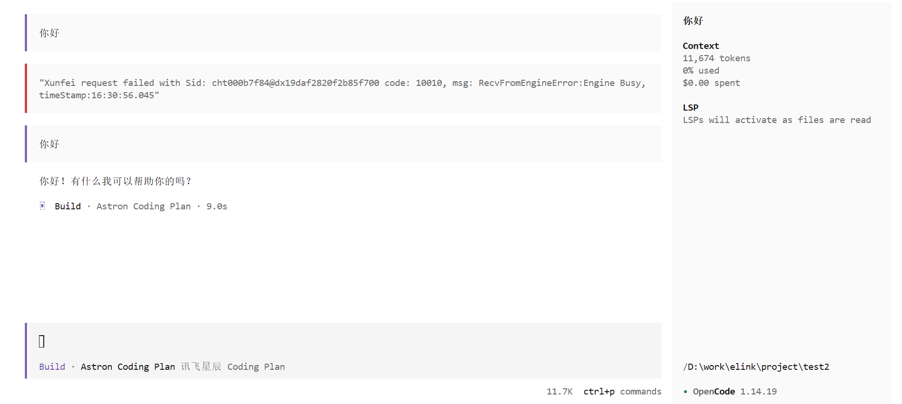
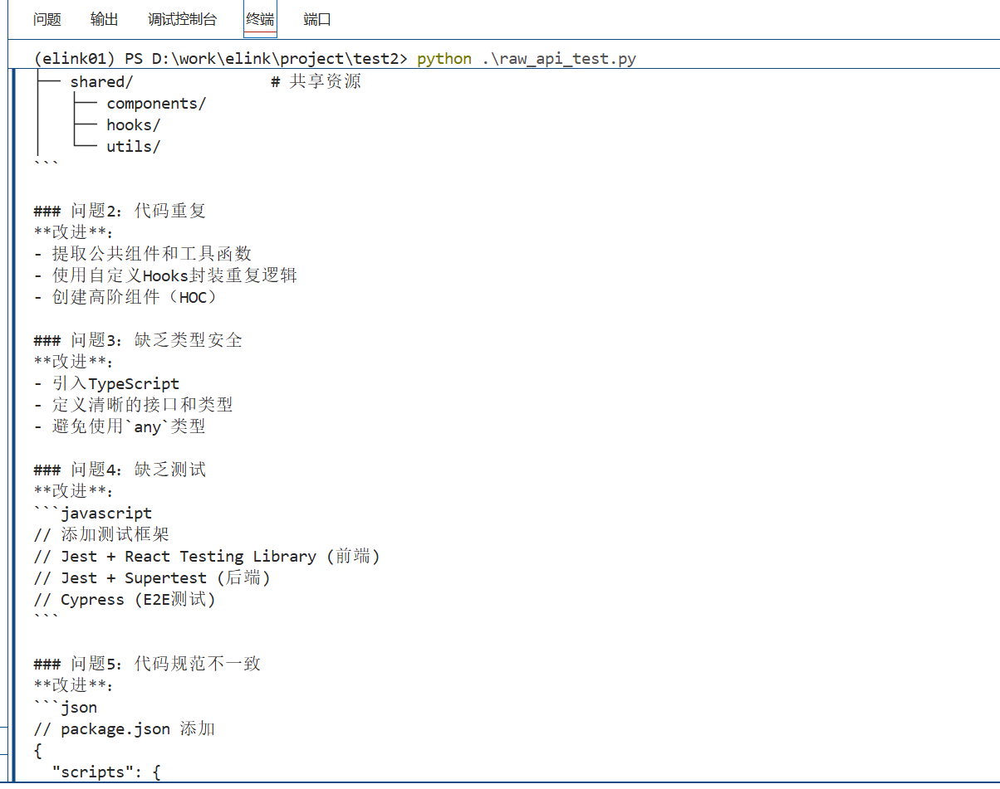
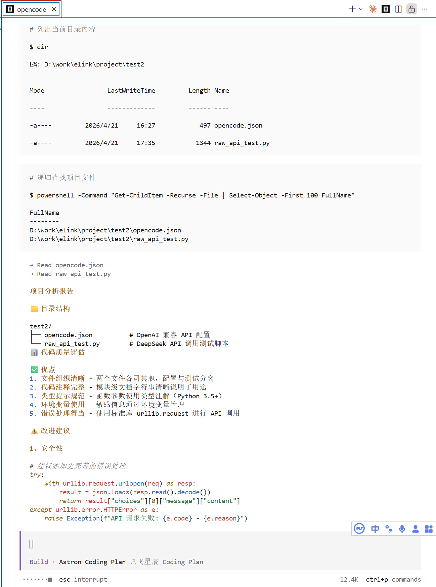

### **任务 1：安装 OpenCode 并完成环境配置**

安装 OpenCode（参考 GitHub README），配置国产模型 API （推荐 DeepSeek，也可选 Qwen/GLM/Kimi）。截图验证：opencode --version + 第一次对话成功。



### **任务 2：对比实验：裸 API 调用 vs OpenCode 编排**

用 Python 直接调用模型 API 完成一个小任务（如分析一段代码），再用 OpenCode 完成同一个任务。
对比两者的差异，写一段 200 字的体会：你感受到了什么是“无状态”和“有状态”？

- api调用



- opencode调用



- 体会

```
# 裸 API vs OpenCode 对比体会

## 实验过程
- **裸 API 调用**：我直接把代码片段和“请分析目录结构”写进 Prompt，模型返回了通用建议，但它不知道项目里实际有哪些文件、各模块如何组织。它只能基于我手动粘贴的零散信息“盲猜”，无法主动读取目录树或代码文件。

- **OpenCode 编排**：OpenCode 先自动扫描了项目文件夹，列出了 `opencode.json`、`raw_api_test.py` 等实际结构，然后逐文件读取关键代码。接着它结合上下文给出了针对性的改进建议，比如 添加完善的错误处理、环境变量验证

## 关键差异
- **差异 1：是否能读文件** —— 裸 API 不能；OpenCode 能主动读取项目文件和目录结构。
- **差异 2：是否有上下文感知** —— 裸 API 每次调用都是“失忆”的，需要我重复背景；OpenCode 记住之前读取过的结构和分析结论，可以追问或细化。
- **差异 3：建议是否具体** —— 裸 API 的建议通用；OpenCode 的建议具体。

## 我对「无状态推理」和「有状态编排」的理解
**无状态推理**就像每次向一位新来的专家提问——他只能靠我当前给的提示作答，不知道我之前问过什么，也看不到我身边的文件环境。**有状态编排**则像有位专属助手，他能持续记住项目现状、历史对话和文件内容，我只需说“继续优化刚才那个模块”，他就懂。核心差别：无状态省资源但累人（要反复交代背景），有状态有记忆但需维护会话——实际编码任务中，后者体验顺畅得多。
```


### **任务 3：阅读 OpenCode 源码中的编排循环（选学）**

找到 OpenCode 源码中主循环（Agent Loop），理解它是如何实现“观察 → 思考 → 行动 → 更新状态”的。在群里分享你找到的关键代码片段。