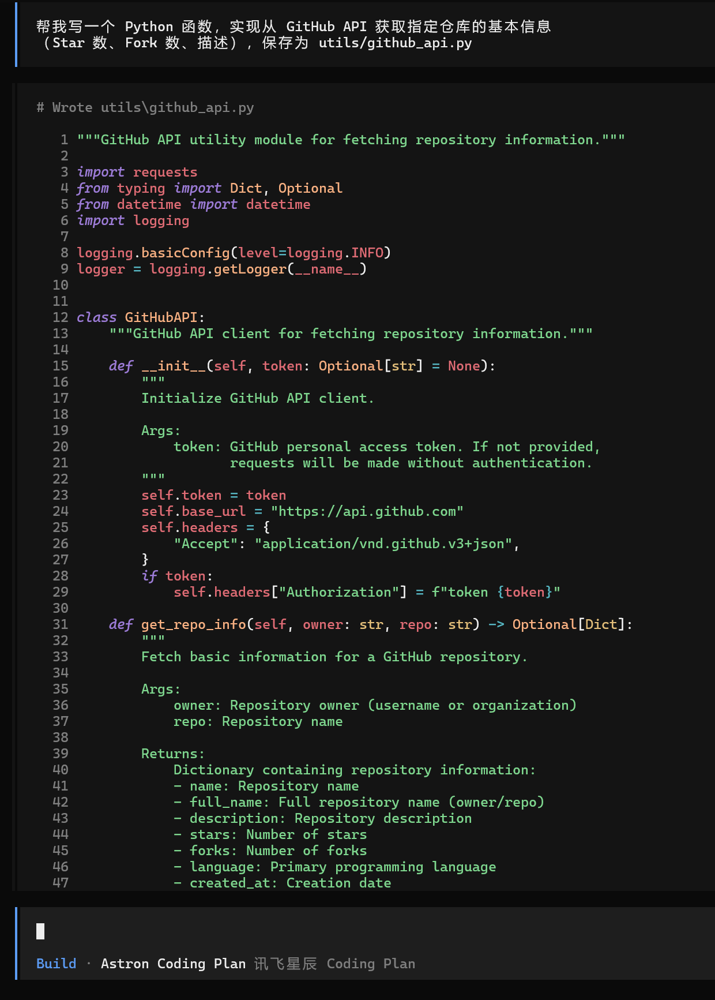
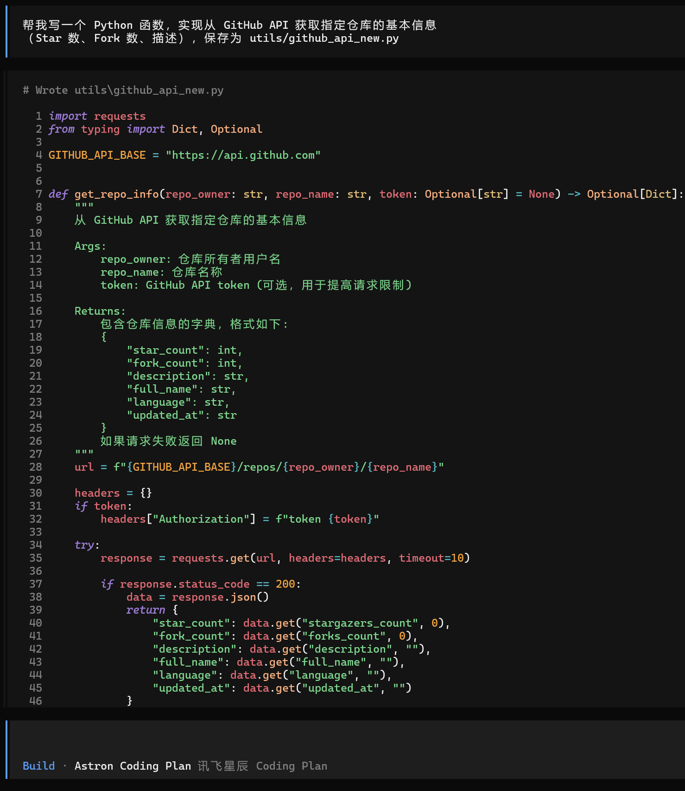
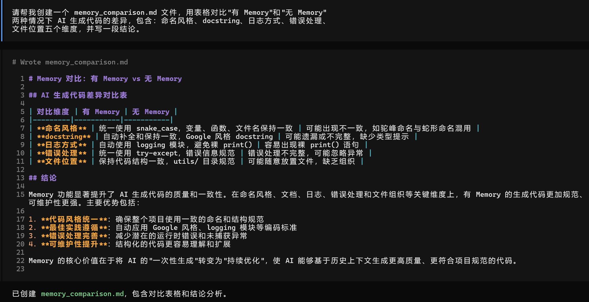

### **任务 1：为你的项目编写 AGENTS.md**

选择一个你正在做的项目（或创建一个新项目），按照 6 个组成部分的框架，编写一份完整的 AGENTS.md。至少包含：项目概述、技术栈、编码规范、项目结构。

```
# AGENTS.md

## 项目概述

AI 知识库助手自动从 GitHub Trending 和 Hacker News 采集 AI/LLM/Agent 领域的技术动态，经过 AI 分析后结构化存储为 JSON，并支持通过 Telegram 和飞书进行多渠道分发。

## 技术栈

- Python 3.12
- OpenCode + 国产大模型
- LangGraph
- OpenClaw

## 编码规范

- PEP 8 风格指南
- snake_case 命名规范
- Google 风格 docstring
- 禁止裸 print() 语句 - 使用 logging 替代

## 项目结构

​```
.opencode/
├── agents/          # Agent 定义和配置
└── skills/          # 可复用的技能和工具

knowledge/
├── raw/             # 原始抓取内容和数据
└── articles/        # 结构化 JSON 知识库

[其他项目目录根据需要添加]
​```

## 知识条目 JSON 格式

​```json
{
  "id": "unique_identifier",
  "title": "Entry title",
  "source_url": "https://source.com/article",
  "summary": "AI-analyzed summary",
  "tags": ["ai", "llm", "agent"],
  "status": "new|processing|published|archived",
  "collected_at": "2024-01-15T10:30:00Z",
  "analyzed_at": "2024-01-15T10:35:00Z",
  "source": "github_trending|hacker_news"
}
​```

## Agent 角色概览

| Agent 角色 | 主要职责 | 关键操作 |
|------------|----------|----------|
| 采集器 | 从数据源获取原始内容 | 抓取 GitHub Trending、Hacker News、监控 feeds |
| 分析器 | 处理和分析内容 | 提取关键洞察、结构化数据、AI 分析 |
| 分发器 | 发布到各渠道 | 发送到 Telegram、飞书、更新知识库 |

## 红线（绝对禁止的操作）

- 禁止裸 print() 语句
- 禁止直接在代码中存储 API 密钥
- 禁止在未备份的情况下修改生产数据
- 禁止忽略错误日志
- 禁止提交密钥或敏感数据
- 禁止绕过认证机制
- 禁止未经同意修改用户数据
- 禁止使用已废弃或不支持的库
- 禁止没有适当错误处理的并行执行
- 禁止忽略数据验证和清理

```


### **任务 2：对比实验：有 Memory vs 无 Memory**

在 OpenCode 中，分别在有 AGENTS.md 和删除 AGENTS.md 的情况下，给出同样的编程指令（如“写一个用户登录接口”），对比两次产出的代码质量、代码风格和规范遵守程度。截图记录差异。

- 有 AGENTS.md



- 删除AGENTS.md



- 差异




### **任务 3：思考题：你的 Memory 遗漏了什么？**

在使用 Agent 的过程中，观察它是否产出了不符合你期望的代码。如果有，思考是 AGENTS.md 里缺了什么规则，然后补充上去

- 生成的代码的注释是英文的