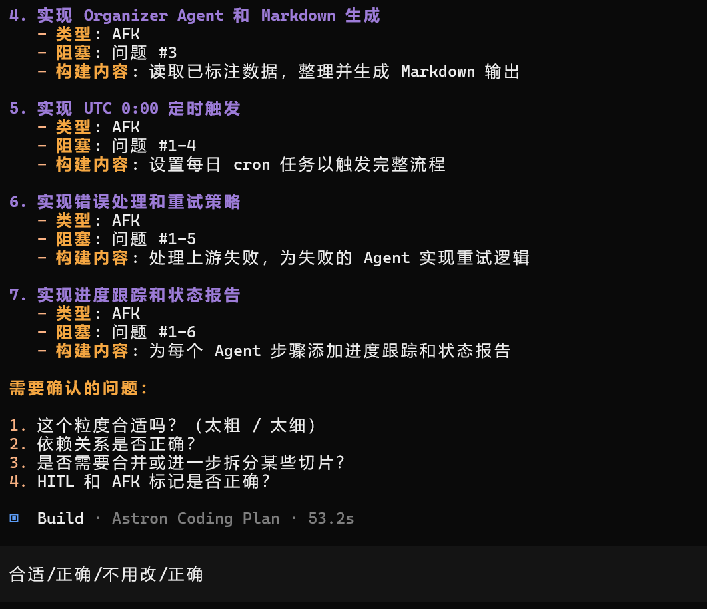
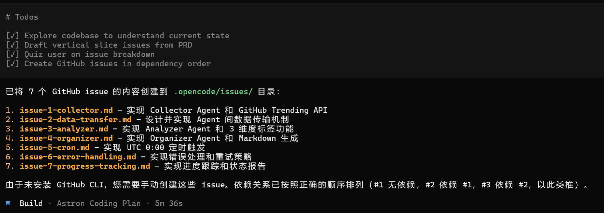

SSD测试

### 前期准备

前置已经有3个agent

安装skills

```
npx skills@latest add mattpocock/skills/prd-to-plan -a opencode
ls ~/.opencode/skills/
```


### 新增文件

specs/agents-prd.md

```
# AI 知识库 · 三 Agent PRD v0.1

## 总流程
每天 UTC 0:00 触发 · collector → analyzer → organizer · 串行。

## Agent 职责
- collector: 抓 GitHub Trending Top 50 · 过滤 AI 相关 · 存 knowledge/raw/
- analyzer: 读 raw · 给每条打 3 维度标签
- organizer: 读已标注 · 整理成 MD

## 开放问题（? 用 to-issues 细化成任务）
- 上游失败下游怎么办？
- 数据怎么传？文件 or 消息？
- 重跑策略？
- 进度追踪？
```


### 触发任务

进入opencode

```
/skill 
/to-issues specs/agents-prd.md
```

就会自动运行，期间会要给一版然后让你确定



然后就自动执行任务，生成了一下的issue



