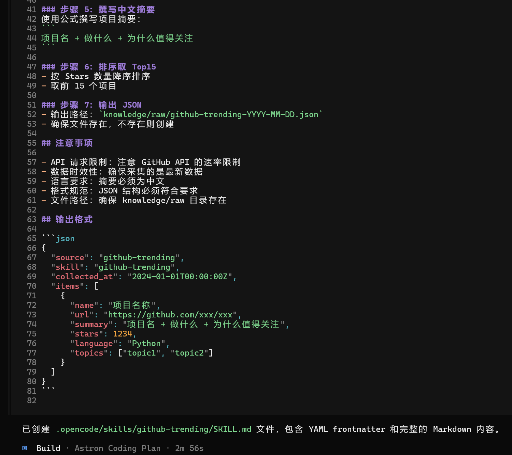
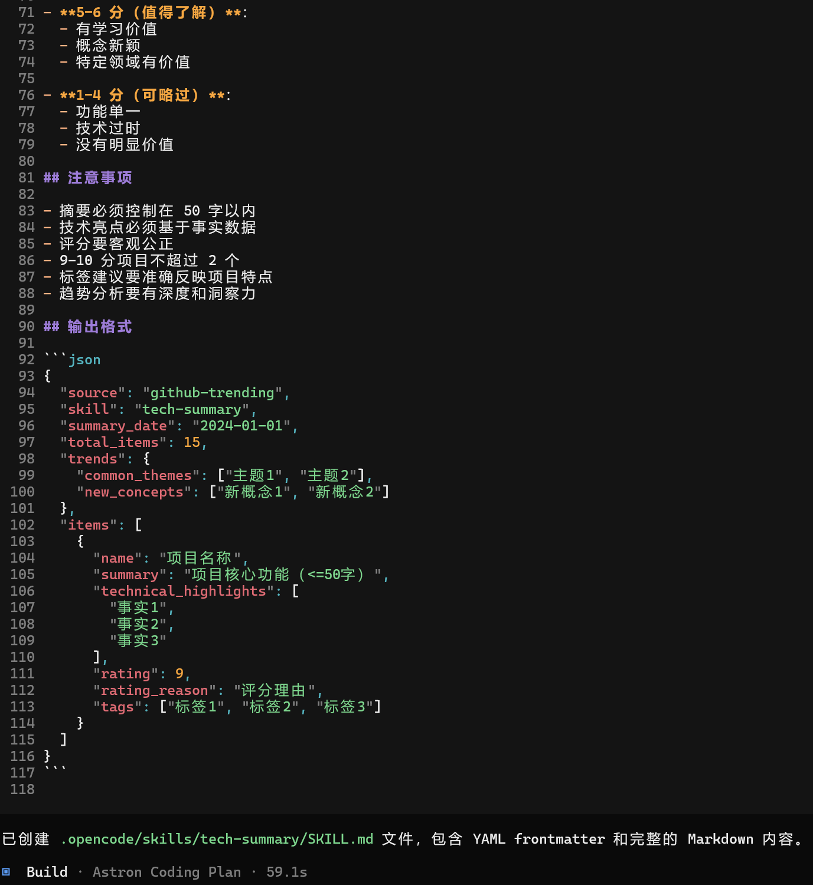
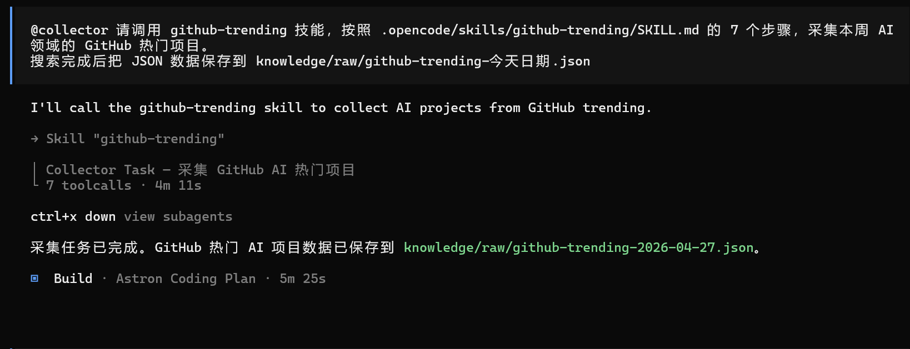
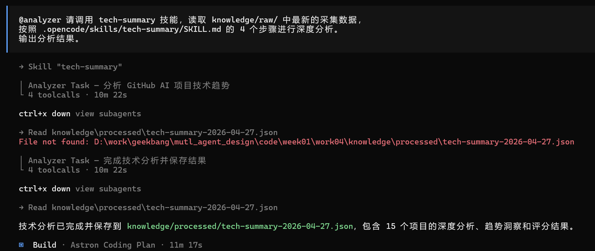

### **任务 1：封装一个自定义 Skill**

参考 github-trending 和 tech-summary 的格式，自己设计一个新的 SKILL.md。可选方向：arxiv-papers（采集 arXiv 最新 AI 论文）、producthunt-daily（Product Hunt 日榜）、weixin-tech（微信公众号技术文章采集）
要求：YAML 元数据完整、步骤原子化、输入输出明确。

- 跑 github-trending skill

- 跑tech-summary skill

### **任务 2：跑通 V1 完整流程（采集 + 分析）**

在 OpenCode 中分别触发 github-trending 和 tech-summary 技能，完成一次完整的“采集 → 分析”流程。检查产出 JSON 的格式是否符合 SKILL.md 定义：字段全不全？摘要符不符合公式？评分有没有区分度？不满意就修改 SKILL.md 后重新执行——这就是 Skill 工程的迭代循环。

- github-trending

- tech-summary

### 任务 3：（可选挑战）对比有 Skill 和无 Skill 的执行效果**

用同样的需求分别测试两种方式：1）不加载 Skill，纯自然语言描述需求；2）加载 Skill 后执行。对比产出的 JSON 格式一致性、内容质量、执行时间。把对比结果写成简短总结——这就是 Skill 的价值证明。