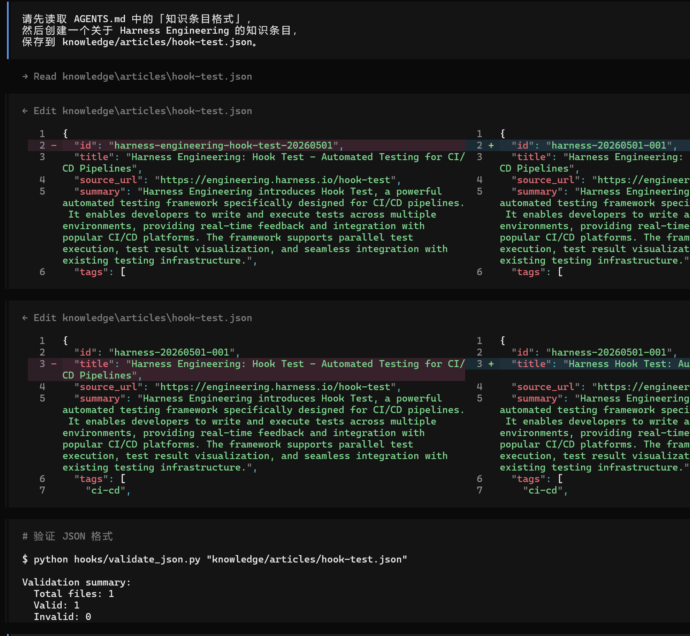

## hooks实践

### 1.创建 hooks 目录

```
mkdir -p hooks
```


### 2.用 AI 编程工具生成 validate_json.py

```
请帮我编写一个 Python 脚本 hooks/validate_json.py，用于校验知识条目 JSON 文件：

需求：
1. 支持单文件和多文件（通配符 *.json）两种输入模式
2. 检查 JSON 是否能正确解析
3. 必填字段使用 dict[str, type] 格式，同时校验字段存在性和类型：
   id(str), title(str), source_url(str), summary(str), tags(list), status(str)
4. 检查 ID 格式是否为 {source}-{YYYYMMDD}-{NNN}（如 github-20260317-001）
5. 检查 status 是否为 draft/review/published/archived 之一
6. 检查 URL 格式（https?://...）
7. 检查摘要最少 20 字、标签至少 1 个
8. 检查 score（如有）是否在 1-10 范围，audience（如有）是否为 beginner/intermediate/advanced
9. 命令行用法：python hooks/validate_json.py <json_file> [json_file2 ...]
10. 校验通过 exit 0，失败 exit 1 + 错误列表 + 汇总统计

编码规范：遵循 PEP 8，使用 pathlib，不依赖第三方库
```


### 3.创建测试用例

```
mkdir -p knowledge/articles

cat > knowledge/articles/test-good.json << 'EOF'
{
  "id": "github-20260310-001",
  "title": "OpenCode",
  "source_url": "https://github.com/nicepkg/opencode",
  "summary": "开源 AI 编程终端工具，支持 100+ 模型，MIT 协议，Go 语言编写，支持国产模型直连",
  "tags": ["agent", "tool-use", "code-generation"],
  "status": "review",
  "score": 9
}
EOF
```

```
cat > knowledge/articles/test-bad.json << 'EOF'
{
  "id": "bad",
  "title": "测试",
  "status": "unknown_status"
}
EOF
```


### 4.运行校验

```
# 校验正确文件
python hooks/validate_json.py knowledge/articles/test-good.json

# 校验有问题的文件
python hooks/validate_json.py knowledge/articles/test-bad.json

# 批量校验（支持通配符）
python hooks/validate_json.py knowledge/articles/*.json
```


### 5.用 AI 编程工具生成 check_quality.py

```
请帮我编写一个 Python 脚本 hooks/check_quality.py，用于给知识条目做 5 维度质量评分：

需求：
1. 支持单文件和多文件（通配符 *.json）两种输入模式
2. 使用 dataclass 定义 DimensionScore 和 QualityReport 结构
3. 5 个评分维度及满分（加权总分 100 分）：
   - 摘要质量 (25 分)：>= 50 字满分，>= 20 字基本分，含技术关键词有奖励
   - 技术深度 (25 分)：基于文章 score 字段（1-10 映射到 0-25）
   - 格式规范 (20 分)：id、title、source_url、status、时间戳五项各 4 分
   - 标签精度 (15 分)：1-3 个合法标签最佳，有标准标签列表校验
   - 空洞词检测 (15 分)：不含"赋能""抓手""闭环""打通"等空洞词
4. 空洞词黑名单分中英两组：
   - 中文：赋能、抓手、闭环、打通、全链路、底层逻辑、颗粒度、对齐、拉通、沉淀、强大的、革命性的
   - 英文：groundbreaking、revolutionary、game-changing、cutting-edge 等
5. 输出可视化进度条 + 每维度得分 + 等级 A/B/C
6. 等级标准：A >= 80, B >= 60, C < 60
7. 退出码：存在 C 级返回 1，否则返回 0

编码规范：遵循 PEP 8，使用 pathlib 和 dataclass，不依赖第三方库
```


### 6.创建测试用例

```
mkdir -p knowledge/articles

cat > knowledge/articles/test-quality-good.json << 'EOF'
{
  "id": "github-20260310-001",
  "title": "OpenCode — 开源 AI 编程终端",
  "source_url": "https://github.com/nicepkg/opencode",
  "summary": "开源 AI 编程终端工具，MIT 协议，支持 100+ 模型直连，基于 Go 语言的 agent 框架，支持 LLM 推理和 RAG 检索",
  "tags": ["agent", "tool-use", "code-generation"],
  "status": "review",
  "score": 9,
  "collected_at": "2026-03-10T08:00:00Z"
}
EOF
```

```
cat > knowledge/articles/test-quality-bad.json << 'EOF'
{
  "id": "bad",
  "title": "一个赋能全链路的革命性的项目",
  "summary": "底层逻辑打通闭环",
  "status": "review"
}
EOF
```


### 7.运行质量评分

```
# 逐个检查
python hooks/check_quality.py knowledge/articles/test-quality-good.json
python hooks/check_quality.py knowledge/articles/test-quality-bad.json

# 批量检查（支持通配符）
python hooks/check_quality.py knowledge/articles/*.json
```


## 2.模拟反馈循环


### 2.1.产出只是条目

```
请先读取 AGENTS.md 中的「知识条目格式」部分，
然后按照其中定义的 JSON 格式，创建一个关于 LangGraph 的知识条目，
保存到 knowledge/articles/test-loop.json。

要求：
1. 所有必填字段都要有（id, title, source_url, summary, tags, status）
2. status 设为 "draft"
3. tags 至少 2 个
4. summary 不超过 50 字
```


### 2.2.用校验脚本检查

```
python hooks/validate_json.py knowledge/articles/test-loop.json
python hooks/check_quality.py knowledge/articles/test-loop.json
```


### 2.3.根据报错修复

```
刚才创建的 test-loop.json 校验不通过，错误如下：

[错误信息]

请重新读取 AGENTS.md 中的「知识条目格式」部分，对照修正这个文件。  
```

> 不对就重复上面的提交修复

### 2.4.再次校验

校验通过


## 3.配置 TypeScript Plugin 自动 Hook

### 3.1.初始化插件环境

```
cd ~/ai-knowledge-base
mkdir -p .opencode/plugins
cd .opencode
npm init -y
npm install @opencode-ai/plugin
```


### 3.2.生成校验插件

```
请帮我编写一个 OpenCode TypeScript 插件 .opencode/plugins/validate.ts：

需求：
1. 监听 tool.execute.after 事件
2. 当 Agent 使用 write 或 edit 工具写入 knowledge/articles/*.json 时触发
3. 触发时调用 python3 hooks/validate_json.py <file_path>
4. 使用 Bun Shell API（$ 模板字符串）执行命令
5. 必须使用 .nothrow() 而非 .quiet()（.quiet() 会导致 OpenCode 卡死）
6. 必须用 try/catch 包裹所有 shell 调用（未捕获异常会阻塞 Agent）

关键 API：
- import type { Plugin } from "@opencode-ai/plugin"
- input.tool 是工具名（如 "write"、"edit"）
- input.args.file_path 或 input.args.filePath 是文件路径
```


### 3.3.验证 Hook 是否生效

```
请先读取 AGENTS.md 中的「知识条目格式」，
然后创建一个关于 Harness Engineering 的知识条目，
保存到 knowledge/articles/hook-test.json。
所有必填字段都要有，status 设为 "draft"。
```

> 如果 Hook 生效，你会看到校验脚本的输出自动打印
>
> 可能是 OpenCode 版本差异。 手动跑 `python3 hooks/validate_json.py knowledge/articles/hook-test.json` 完全 OK


> 挺神奇的，没触发成功
>
> 然后跟它沟通 

```
为啥没触发plugin 呢 ？
```

> 反馈是因为错误的就不会触发，然后把最后的一行去掉重新执行就触发了

```
请先读取 AGENTS.md 中的「知识条目格式」，
然后创建一个关于 Harness Engineering 的知识条目，
保存到 knowledge/articles/hook-test.json。
```

